# FoodExpress

> A modern Android food ordering application that lets users discover restaurants, browse menus, manage a cart, place orders, and track their deliveries.

[](https://developer.android.com/)
[](https://firebase.google.com/)
[](https://developers.google.com/maps)
[](https://gradle.org/)

## Overview

**FoodExpress** is an Android-based food ordering application developed as a Software Engineering project for **SWE 250**.

The application provides a complete customer-side ordering flow, starting from account creation and restaurant discovery through menu selection, cart management, checkout, payment selection, order placement, and delivery tracking.

The project is built as a native Android application and uses Firebase services for authentication, cloud data, storage, messaging, and analytics. Google Maps and location services are integrated to enhance the user experience with location-based features.

## Key Features

### Authentication
- User registration and login
- Email/password authentication
- Password reset flow
- Google sign-in support
- User profile management

### Restaurant Discovery
- Home screen with personalized greeting
- Restaurant browsing
- Food categories
- Popular restaurant and food listings
- Restaurant details and ratings
- Menu browsing

### Ordering
- Add food items to cart
- Adjust item quantities
- View cart summary
- Delivery address selection
- Location-based address support
- Checkout flow
- Payment method selection
- Order confirmation

### Order Management
- Order history
- Current order status
- Delivery progress
- Order details
- Reorder / continue ordering flow

### Notifications
- Push notification support through Firebase Cloud Messaging
- Order-related notification capability

### Profile & Account
- View and edit personal information
- Manage account details
- Access order history
- Sign out securely

## Application Flow

```text
Register / Login
       │
       ▼
     Home
       │
       ├── Browse Categories
       │
       ├── Explore Restaurants
       │        │
       │        ▼
       │     Restaurant
       │        │
       │        ▼
       │      Menu
       │        │
       │        ▼
       └────── Cart
                │
                ▼
             Checkout
                │
         ┌───────┴────────┐
         ▼                ▼
  Delivery Address    Payment Method
         │                │
         └───────┬────────┘
                 ▼
         Order Confirmation
                 │
                 ▼
           Order Tracking
                 │
                 ▼
           Order History
```

## Technology Stack

| Area | Technology |
|---|---|
| Platform | Android |
| Build System | Gradle |
| Build Configuration | Kotlin DSL |
| UI | Android XML layouts + View Binding |
| UI Components | AndroidX, Material Components, RecyclerView, CardView |
| Navigation | Android Navigation Component |
| Authentication | Firebase Authentication |
| Database | Firebase Firestore |
| File Storage | Firebase Storage |
| Notifications | Firebase Cloud Messaging |
| Analytics | Firebase Analytics |
| Maps | Google Maps SDK for Android |
| Location | Google Play Services Location |
| Image Loading | Glide |
| Google Sign-In | Android Credential Manager + Google Identity |

The current project configuration targets **Android API 34**, supports devices from **API 24**, and uses **Java 11** compatibility settings.

## Architecture & Project Structure

The repository follows a standard Android application structure:

```text
SWE-250-Project/
├── app/
│   ├── src/
│   │   └── main/
│   │       ├── java/ or kotlin/
│   │       ├── res/
│   │       │   ├── drawable/
│   │       │   ├── layout/
│   │       │   ├── mipmap/
│   │       │   ├── values/
│   │       │   └── ...
│   │       └── AndroidManifest.xml
│   ├── build.gradle.kts
│   └── google-services.json
│
├── gradle/
│   └── libs.versions.toml
│
├── image/
│   └── project assets
├── screenshots/
│   └── App's screenshots
│
├── build.gradle.kts
├── settings.gradle.kts
├── gradle.properties
├── gradlew
├── gradlew.bat
└── README.md
```

> The exact package-level organization may evolve as the project is developed. The structure above describes the major repository components.

## Getting Started

### Prerequisites

Before running the project, install:

- Android Studio
- Android SDK 34
- Android SDK Build Tools
- JDK 11
- A physical Android device or Android Emulator
- A Firebase project
- A Google Maps API key

### 1. Clone the Repository

```bash
git clone https://github.com/Hazerakteritu/SWE-250-Project.git
cd SWE-250-Project
```

### 2. Open in Android Studio

1. Open **Android Studio**.
2. Select **Open**.
3. Choose the cloned `SWE-250-Project` directory.
4. Allow Gradle to sync and download the required dependencies.

### 3. Configure Firebase

The application uses Firebase for authentication, Firestore, storage, messaging, and analytics.

For a new Firebase environment:

1. Create a project in Firebase Console.
2. Add an Android application.
3. Use the application's package ID:

```text
com.example.foodexpress
```

4. Download `google-services.json`.
5. Place it inside:

```text
app/google-services.json
```

6. Enable the Firebase services required by the application:
   - Authentication
   - Cloud Firestore
   - Cloud Storage
   - Cloud Messaging
   - Analytics

If you use the Firebase configuration already associated with the project, verify that it is still active before running the application.

### 4. Configure Google Maps

The application uses Google Maps and location services.

Create a Google Maps API key in Google Cloud Console and enable the required Maps SDK and location services for the Firebase/Google Cloud project.

Add the API key according to the project's Android resource/configuration setup.

> **Security note:** Do not commit unrestricted API keys or private credentials to a public repository.

### 5. Build and Run

Using Android Studio:

```text
Build → Make Project
Run → Run 'app'
```

Or from the command line:

```bash
./gradlew assembleDebug
```

On Windows:

```powershell
gradlew.bat assembleDebug
```

To install the debug APK on a connected device:

```bash
./gradlew installDebug
```

## Firebase Services

The application is configured with the following Firebase services:

| Firebase Service | Purpose |
|---|---|
| Firebase Authentication | User registration, login, and account access |
| Cloud Firestore | Application and ordering data |
| Firebase Storage | Image/file storage |
| Firebase Cloud Messaging | Push notifications |
| Firebase Analytics | Application usage analytics |

## User Journey

### 1. Account Access
Users can create an account or sign in to an existing account. Password recovery is also available.

### 2. Discover Food
After signing in, users can explore food categories, restaurants, popular items, and available menus.

### 3. Select Items
Users open a restaurant, browse its menu, select food items, and add them to the cart.

### 4. Review Cart
The cart provides an overview of selected items, quantities, and the order total before checkout.

### 5. Provide Delivery Information
Users select or provide a delivery address, with Google Maps and location services supporting the address workflow.

### 6. Checkout
Users review their delivery information and choose an available payment method.

### 7. Place Order
After confirmation, the order is submitted and the user receives an order confirmation.

### 8. Track Orders
Users can view order progress and access previous orders from the order history section.

## Screenshots

The application provides a seamless user experience across all features. Below are key screenshots illustrating the primary user workflows:

### Authentication and Account

| Welcome Screen | Login | Registration |
|---|---|---|
| 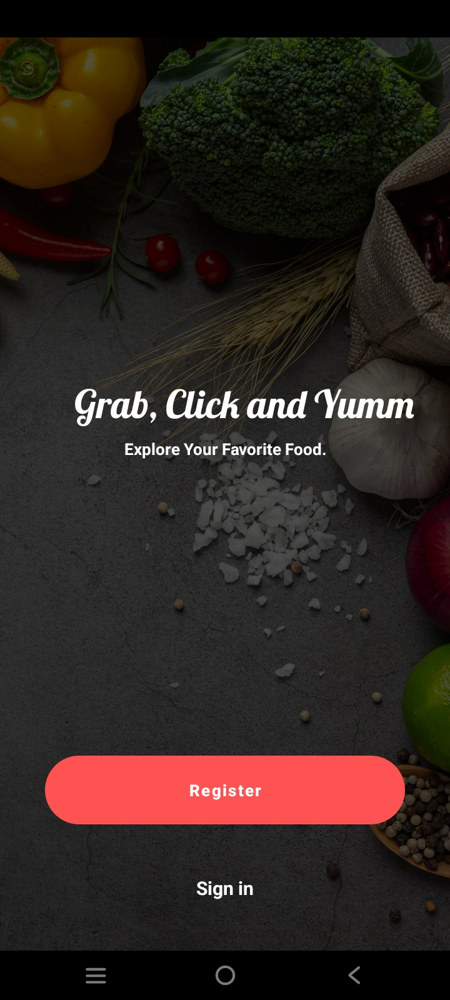 | 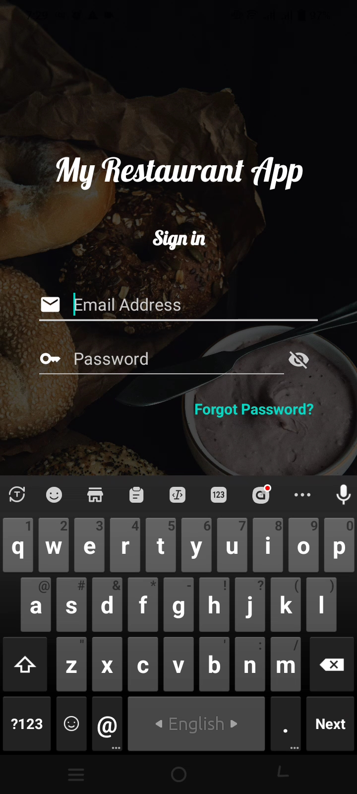 | 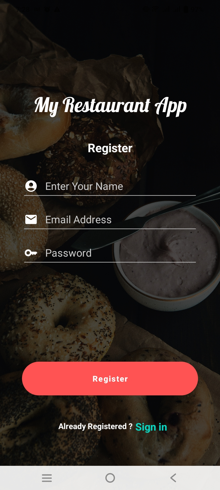 |

### Restaurant Discovery and Selection

| Home Screen | Restaurant Details | Menu |
|---|---|---|
| 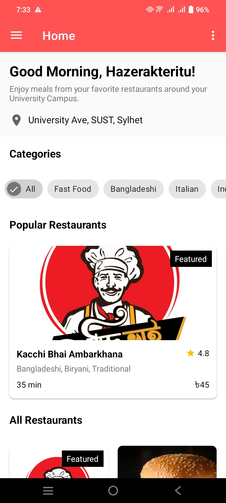 | 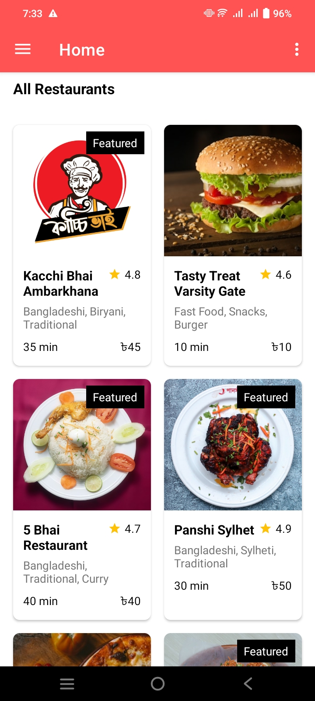 | 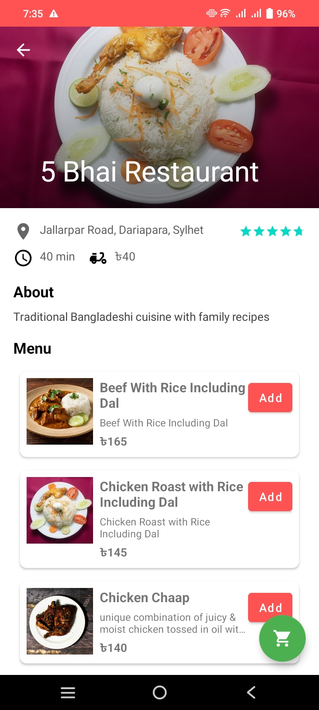 |

### Shopping and Checkout

| Cart Summary | Add to Cart | Order Placed |
|---|---|---|
| 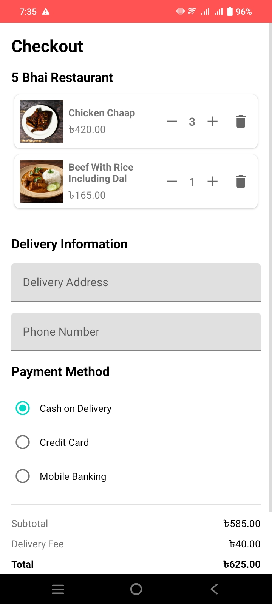 | 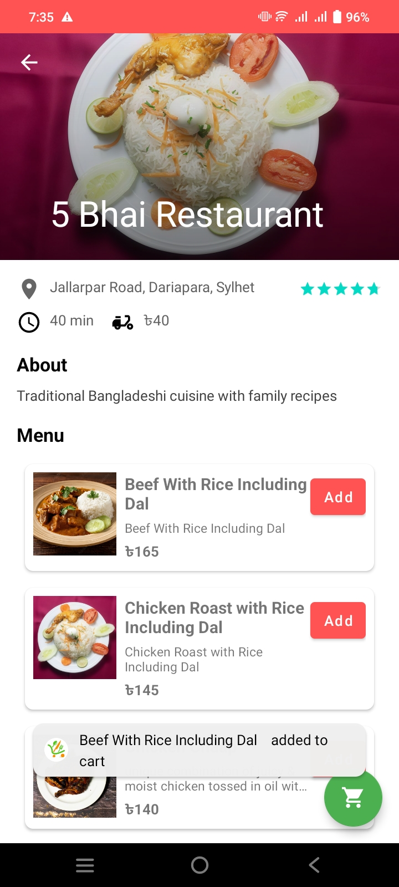 | 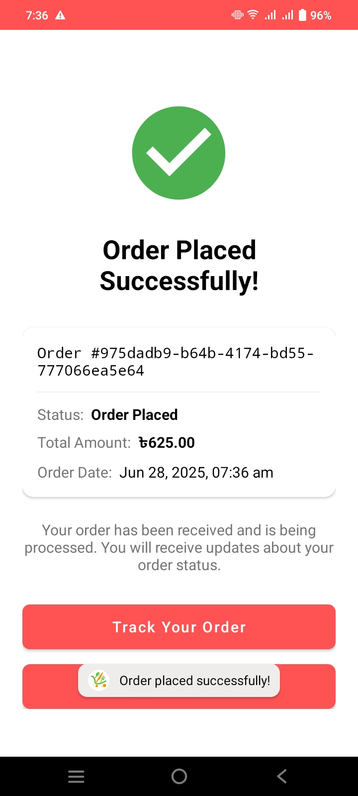 |

### Order Tracking and Delivery

| Order Tracking | Delivery Progress | Order Delivered |
|---|---|---|
| 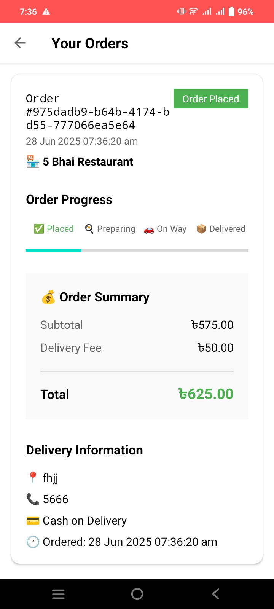 | 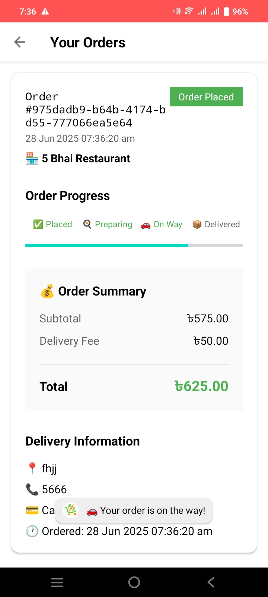 | 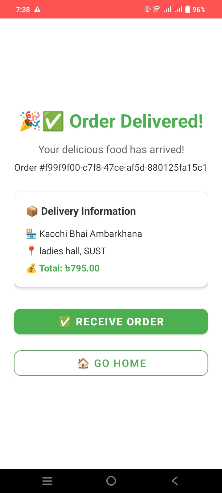 |

### User Account

| User Profile | Navigation Menu | Location Map |
|---|---|---|
| 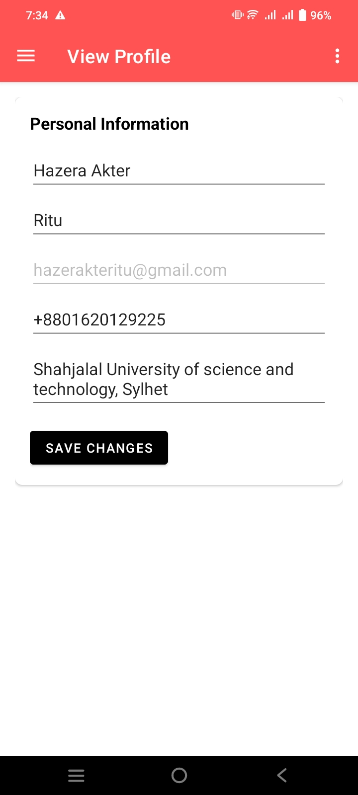 | 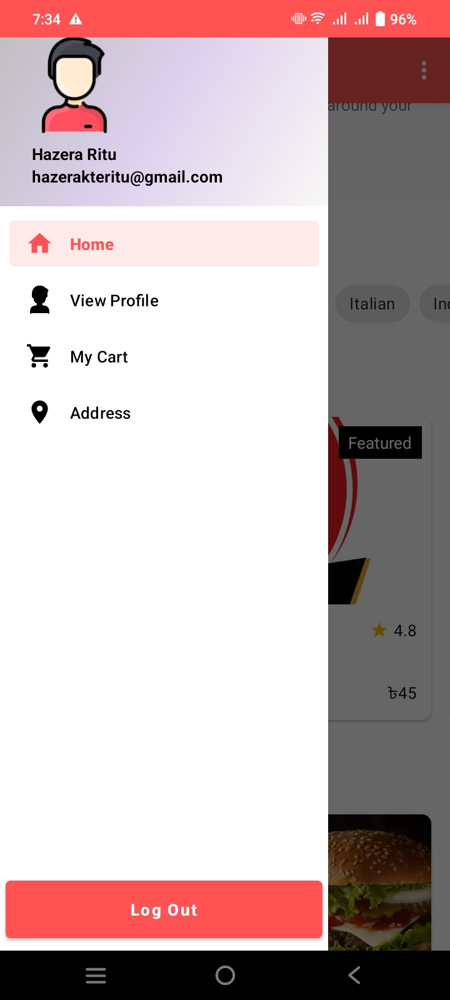 | 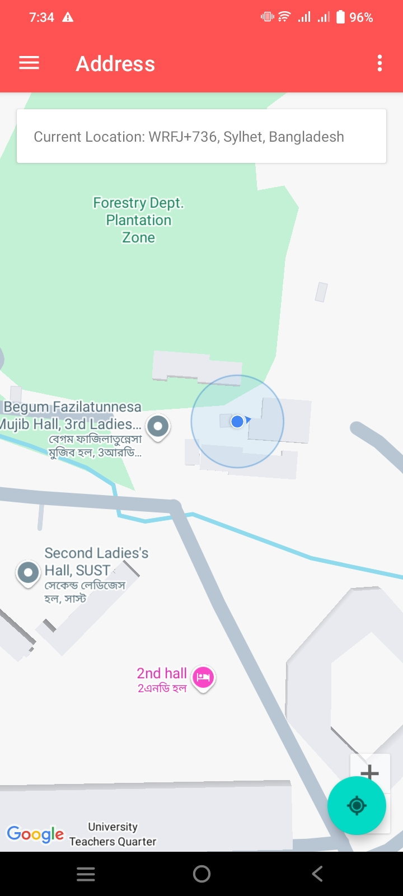 |

## Build Configuration

Current application configuration:

```text
Application ID: com.example.foodexpress
Compile SDK:    34
Target SDK:     34
Minimum SDK:    24
Java:           11
Version:        1.0
Version Code:   1
```

## Academic Context

**Course:** SWE 250 — Project Work II  
**Project:** FoodExpress  
**Platform:** Android  
**Repository:** [Hazerakteritu/SWE-250-Project](https://github.com/Hazerakteritu/SWE-250-Project)

This project was developed as part of an academic software engineering project with an emphasis on requirements, application design, and implementation.


<p align="center">
  <strong>FoodExpress</strong><br>
  A complete Android food ordering experience.
</p>
